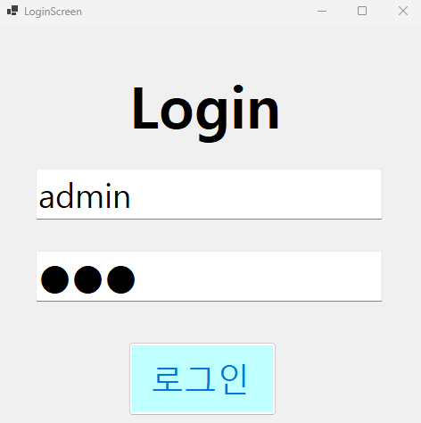
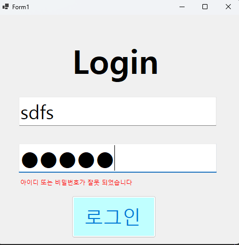

# (C# 코딩) 에코메신저
## 개요
-C# 프로그래밍학습
 
-1줄소개: 아이디와 패스워드를 입력하여 로그인할 수 있는 간단한 화면
 
-사용한 플랫폼: C#, .NET Windows Forms, Visual Studio, GitHub
 
-사용한 컨트롤:Label, TextBox, Button, enter와 leave 이벤트
 
-사용한 기술과 구현한 기능:이벤트에서 enter와 leave이벤트를 이용하여 텍스트박스에 아이디와 패스워드가 회색으로 표시되고 입력을 하면 검정색으로 입력되는 기능 구현하였다. 또한 tab키나 enter를 이용하여 로그인, 아이디, 비밀번호 순서대로 넘어가게 구현하고 아이디와 비밀번호가 설정한 것과 맞으면 맞았다고 뜨고 틀리면 틀렸다고 뜨게 하는 기능도 구현하였다. 글의 크기와 색을 조절하는 기능도 구현하고 텍스트박스의 이름을 알아볼 수 있게 바꿔주는 기능도 구현하였다.
 
-Visual Studio를 이용하여
 
-string 클래스를이용한사용자입력데이터처리
 
-DateTime클래스를이용한현재시간정보구하기
 
-수업중에배우고사용했던클래스들관련된설명-
 
--실습중에구현한기능들설명--
 
아이디와 패스워드를 입력전 회색으로 어디에 무엇을 입력해야하는지 나타나게 했으며 입력하는 곳에 올려두면 사라지고 입력을 하면 검정색으로 입력하게 되며 비밀번호는 안보이게 구현하였다

## 실행화면(과제1)
-과제1코드의실행스크린샷
 

 
 
-과제내용 : 아이디와 패스워드를 입력하여 로그인할 수 있는 간단한 화면을 구현하였다.
 
-TextBox, Button, ListBox를 배치
 
-아이디와 패스워드 회색으로 표시되며 tab이나 마우스로 놓으면 글이 사라지고 입력을 하면 검정색으로 입력된다.
 
-tab을 누르면 로그인, 아이디, 비밀번호 순서대로 넘어간다
 
-아이디와 비밀번호가 설정한 것과 맞으면 맞았다고 뜨게 한다
 
-글의 크기와 색을 조절한다
 
-textbox의 이름을 알아볼 수 있게 바꾼다.

## 실행화면(과제2)
-과제2코드의실행스크린샷
 

 
 
-과제내용 : 틀렸을 때 틀렸다고 뜨게 하며 enter키로도 로그인할 수 있게 구현하였다.
 
-tab이 아닌 enter를 통하여 로그인과 다음으로 넘어갈 수 있다.
 
틀렸을 때 틀렸다고 뜨지만 만약 틀리지 않았지만 입력하기 전에는 틀렸다는 빨간 글씨가 나타나지 않게 하며 틀렸을 때만 밑에 비밀번호와 아이디가 틀렸다고 작게 나오게 한다.
 
-enter를 눌렀을 때 전에는 맞았다고 나오는 것 처럼 뜨게 하였지만 과제1에서 그것을 삭제하여 깔끔하게 수정해준다.